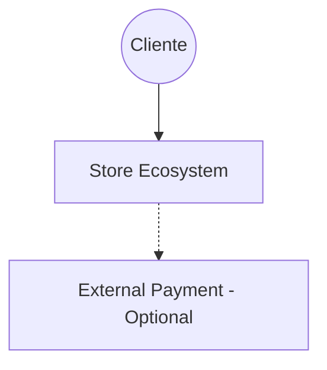
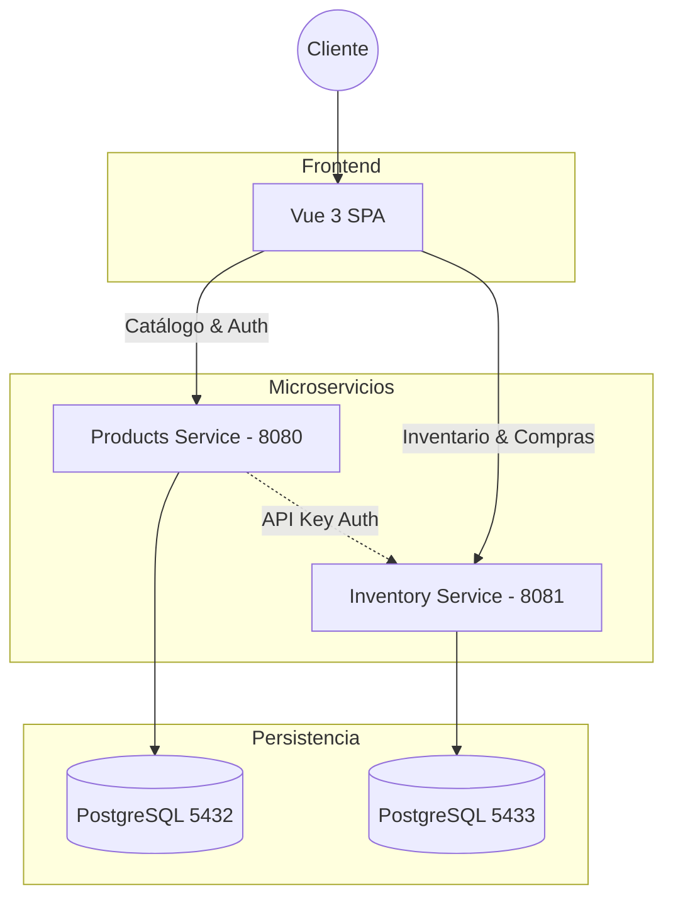

# Arquitectura del Sistema (C4 Model)

## Contexto del Sistema (Nivel 1)
El sistema permite a los clientes finales explorar un catálogo de productos y realizar compras seguras.

## Contenedores (Nivel 2)
El ecosistema está compuesto por microservicios desacoplados que interactúan para garantizar la consistencia.

### Componentes Clave
- **Vue 3 + Pinia**: Gestiona el estado local, cache de productos y la UI responsiva.
- **Products Service**: Gestiona el catálogo, usuarios y emite tokens JWT.
- **Inventory Service**: Gestión de stock físico, garantiza la idempotencia de las compras y previene sobreventas mediante bloqueo optimista.
