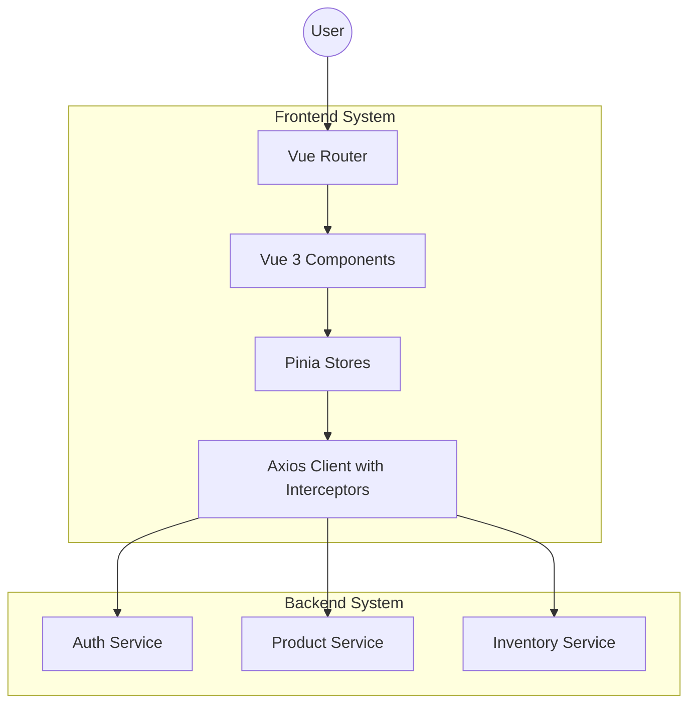

# Architecture & Technical Decisions

## 🏗️ Architecture (C4 Level 2)

## 🧠 Technical Decisions

### 1. State Management (Pinia)
- **Why**: Standard for Vue 3, lightweight, and supports modular stores.
- **Implementation**: Used for Auth (token persistence) and Products (global catalog).
- **Caching**: Implemented a timestamp-based cache in the product store to reduce redundant API calls.

### 2. Resilience & Idempotency
- **Retry Logic**: Axios interceptors handle temporary network failures by retrying up to 3 times with a delay.
- **Error Handling**: Specific status codes (409/422) are mapped to user-friendly messages to provide clear feedback on stock issues or validation errors.

### 3. Styling (Tailwind CSS)
- **Why**: Allows for rapid, consistent UI development without leaving the HTML.
- **Glassmorphism**: Custom utility classes created for a premium SaaS feel.

### 4. Testing Strategy
- **Vitest**: Fast, Vite-native unit testing for business logic (stores).
- **Playwright**: Reliable E2E testing for critical user paths.
